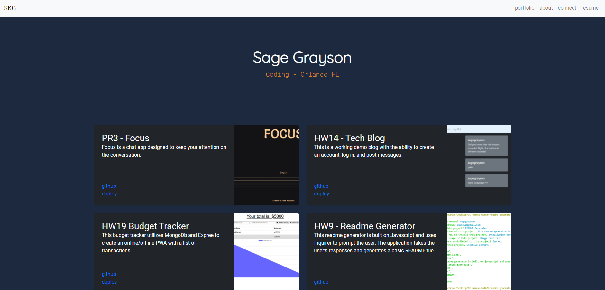

# Updated Portfolio 

## Description

This version of my portfolio has an updated theme and is powered by bootstrap.

## Usage

Go to the [github pages](https://sagegrayson.github.io/HW08-Updated-Portfolio-1/) link.

## License

The project uses the [Creative Commons](https://creativecommons.org/licenses/) license.

## Contact

Link to my github: [sagegrayson](https://github.com/sagegrayson)

If you'd like to contact me, email me at [skaseyg@gmail.com](mailto:skaseyg@gmail.com)
